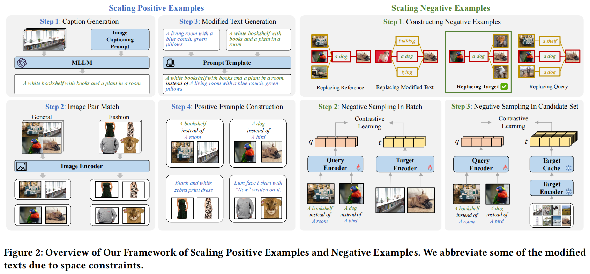
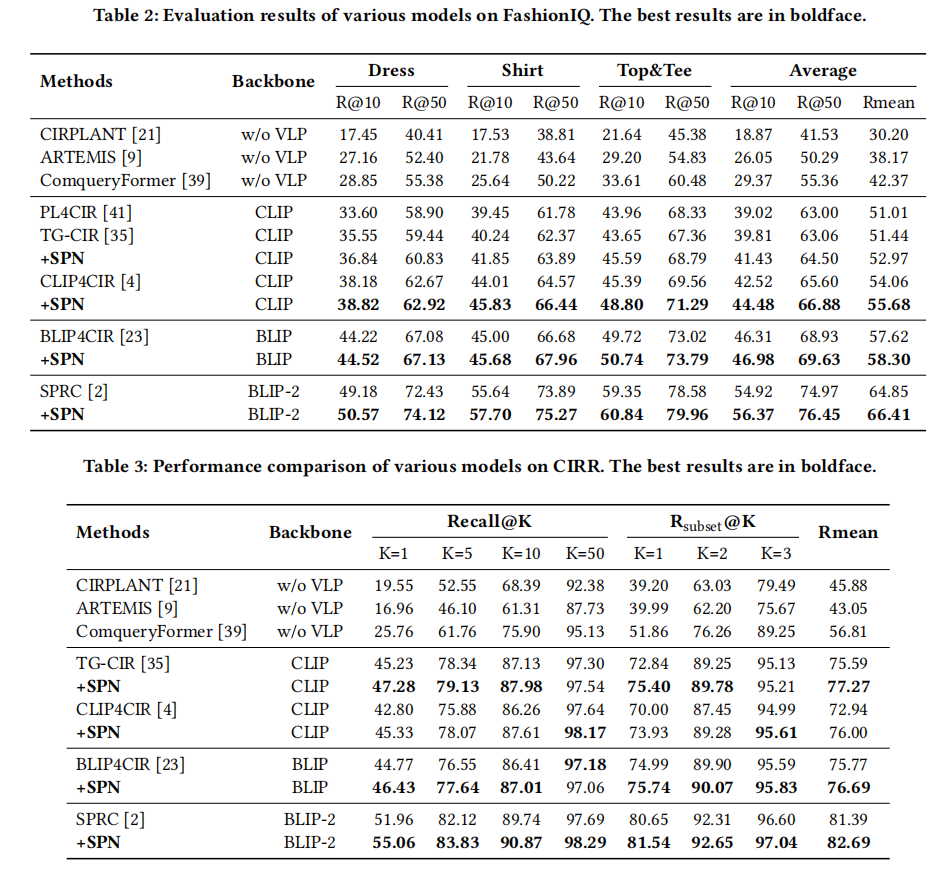

# SPN4CIR: Improving Composed Image Retrieval via Contrastive Learning with Scaling Positives and Negatives (ACM MM 2024)

[](https://github.com/BUAADreamer/CCRK/blob/main/licence)
[](https://arxiv.org/abs/2404.11317)
[](https://pytorch.org/)
[](https://github.com/BUAADreamer/SPN4CIR/stargazers)
[](https://huggingface.co/BUAADreamer/SPN4CIR)

[](https://paperswithcode.com/sota/image-retrieval-on-fashion-iq?p=improving-composed-image-retrieval-via)

[](https://paperswithcode.com/sota/image-retrieval-on-cirr?p=improving-composed-image-retrieval-via)

[](https://paperswithcode.com/sota/zero-shot-composed-image-retrieval-zs-cir-on-2?p=improving-composed-image-retrieval-via)

[](https://paperswithcode.com/sota/zero-shot-composed-image-retrieval-zs-cir-on-1?p=improving-composed-image-retrieval-via)


## Table of Contents

- [Overview](#Overview)
- [Requirements](#Requirements)
- [Checkpoints](#Checkpoints)
- [Pre-Process](#Pre-Process)
- [CLIP4CIR](#CLIP4CIR)
- [TGCIR](#TGCIR)
- [BLIP4CIR](#BLIP4CIR)
- [BLIP24CIR](#BLIP24CIR)
- [ZSCIR](#ZSCIR)
- [Citation](#Citation)
- [Acknowledgement](#Acknowledgement)

## Overview

> The Composed Image Retrieval (CIR) task aims to retrieve target images using a composed query consisting of a reference image and a modified text. Advanced methods often utilize contrastive learning as the optimization objective, which benefits from adequate positive and negative examples. However, the triplet for CIR incurs high manual annotation costs, resulting in limited positive examples. Furthermore, existing methods commonly use in-batch negative sampling, which reduces the negative number available for the model. To address the problem of lack of positives, we propose a data generation method by leveraging a multi-modal large language model to construct triplets for CIR. To introduce more negatives during fine-tuning, we design a two-stage fine-tuning framework for CIR, whose second stage introduces plenty of static representations of negatives to optimize the representation space rapidly. The above two improvements can be effectively stacked and designed to be plug-and-play, easily applied to existing CIR models without changing their original architectures. Extensive experiments and ablation analysis demonstrate that our method effectively scales positives and negatives and achieves state-of-the-art results on both FashionIQ and CIRR datasets. In addition, our methods also perform well in zero-shot composed image retrieval, providing a new CIR solution for the low-resources scenario.

<div align="center">
    
    
</div>

## Checkpoints

You can find all **checkpoints and data** at this huggingface repo: [https://huggingface.co/BUAADreamer/SPN4CIR](https://huggingface.co/BUAADreamer/SPN4CIR)

The checkpoints of the first stage model are taken from the repo of the original paper.

## Requirements

- Prepare python 3.8.13 cuda 12.2 environment
- Install python3 environment

```shell
pip3 install -r requirements.txt
```

- Download FashionIQ and CIRR datasets from corresponding websites and merge them with data we provided like the
  following structure:

```shell
project_base_path
└───  tgcir
	  | train.py
	  | ...

└───  clip4cir
	  | train.py
	  | ...
	  
└───  blip4cir
	  | train.py
	  | ...
	  
└───  blip24cir
	  | train.py
	  | ...

└───  zscir
	  | ...

└───  data # ckpts of the first stage
      └─── tgcir
	  └─── clip4cir
	  └─── blip4cir
	  └─── blip24cir
	  
└───  mm_data # generated caption data
      └─── fiq
	  └─── cirr
	  └─── zs

└───  checkpoints # ckpts of the second stage
      └─── fiq_clip
	  └─── cirr_clip
	  └─── fiq_blip
	  └─── cirr_blip
	  └─── fiq_blip2
	  └─── cirr_blip2
	  └─── fiq_tgcir
	  └─── cirr_tgcir
	 
└───  fashionIQ_dataset
      └─── captions
            | cap.dress.test.json
            | cap.dress.train.json
            | cap.dress.val.json
            | cap.extend_*.train.json
            | ...
            
      └───  images
            | B00006M009.jpg
            | ...
            
      └─── image_splits
            | split.dress.test.json
            | split.dress.train.json
            | split.dress.val.json
            | ...
            
      | optimized_images.json

└───  cirr_dataset  
       └─── train
            └─── 0
                | train-10108-0-img0.png
                | ...
            ...
            
       └─── dev
            | dev-0-0-img0.png
            | ...
       
       └─── test1
            | test1-0-0-img0.png
            | ...
       
       └─── cirr
            └─── captions
                | cap.rc2.test1.json
                | cap.rc2.train.json
                | cap.rc2.val.json
                | cap.rc2.train.extend_*.json
                
            └─── image_splits
                | split.rc2.test1.json
                | split.rc2.train.json
                | split.rc2.val.json
                
      | optimized_images.json
```

## Pre-Process

You can use the data we provide or reproduce these pre-process data by code below.

### 0.Image De-Duplicate

For FashionIQ and CIRR, images should be de-duplicated first.

```shell
#FashionIQ stage 2 
python3 zscir/deduplicate_images.py --dataset fiq --dataset fashionIQ_dataset

#CIRR stage 2
python3 zscir/deduplicate_images.py --dataset cirr --dataset cirr_dataset
```

### 1.Caption Generation

```shell
#FashionIQ
python3 zscir/captioner_llava.py --cir_data fiq --k 5

#CIRR
python3 zscir/captioner_llava.py --cir_data cirr --k 10 

# out-of-domain
python3 zscir/captioner_llava.py --cir_data cc --cc_id 0
python3 zscir/captioner_llava.py --cir_data cc --cc_id 32
python3 zscir/captioner_llava.py --cir_data cc --cc_id 64
python3 zscir/captioner_llava.py --cir_data cc --cc_id 96
python3 zscir/captioner_llava.py --cir_data cc --cc_id 128
python3 zscir/captioner_llava.py --cir_data cc --cc_id 160
python3 zscir/captioner_llava.py --cir_data cc --cc_id 192
```

### 2.Image Pair Match

```shell
#FashionIQ
python3 zscir/srm_utils.py --dataset fiq --data_path fashionIQ_dataset

#CIRR
python3 zscir/srm_utils.py --dataset cirr --data_path cirr_dataset
```

### 3.Modified Text Generation

```shell
# tgcir
python3 zscir/get_cir_data.py --model tgcir --data fiq --refer --i2i_rank 10000 --i2i_rank_max 20000 --p_list 2
python3 zscir/get_cir_data.py --model tgcir --data cirr --i2i_rank 10000 --i2i_rank_max 15000

# clip4cir
python3 zscir/get_cir_data.py --model clip --data fiq --refer --i2i_rank 10000 --i2i_rank_max 20000 --p_list 2 --word_num 4
python3 zscir/get_cir_data.py --model clip --data cirr --i2i_rank 10000 --i2i_rank_max 15000 --word_num 8

# blip4cir
python3 zscir/get_cir_data.py --model blip --data fiq --refer --K 3000 --p_list 2
python3 zscir/get_cir_data.py --model blip --data cirr

# blip24cir
python3 zscir/get_cir_data.py --model blip2 --data fiq --K 6000 --refer --p_list 2
python3 zscir/get_cir_data.py --model blip2 --data cirr --refer

# zs
# In-Domain
python3 zscir/get_cir_data.py --model zs --data fiq --p_list 2 --word_num 5 
python3 zscir/get_cir_data.py --model zs --data cirr 
# Our-of-Domain
python3 zscir/get_cir_data.py --model zs --data ccfiq --p_list 2 --word_num 10
python3 zscir/get_cir_data.py --model zs --data cccirr
```

## CLIP4CIR

We train our model on one Tesla V100 32G with following commands.

You can use the pre-computed data we provide or reproduce these pre-process data by code below.

### Train

Train the second stage from the first stage model.

```shell
#FashionIQ
python3 clip4cir/train.py --dataset fiq --batch-size 256 --num-epochs 3 \
--output_path checkpoints/fiq_clip \
--bank_path checkpoints/fiq_clip/fiq_bank.pth \
--learning-rate 2e-5 --tau 0.02 \
--model_path data/clip4cir/fiq_stage1.pt --plus

#CIRR
python3 clip4cir/train.py --dataset cirr --batch-size 256 --num-epochs 3 \
--output_path checkpoints/cirr_clip \
--bank_path checkpoints/cirr_clip/cirr_bank.pth  \
--learning-rate 2e-5 --tau 0.02 \
--model_path data/clip4cir/cirr_stage1.pt --plus
```

### Validation on FashionIQ and CIRR

```shell
#FashionIQ
python3 clip4cir/validate.py --dataset fiq --data_path fashionIQ_dataset \
--model_path checkpoints/fiq_clip/best.pt

#CIRR
python3 clip4cir/validate.py --dataset cirr --data_path cirr_dataset \
--model_path checkpoints/cirr_clip/best.pt
```

### Test On CIRR

```shell
# Generate 2 json files at submission/clip4cir/
# Then submit them to the test website: https://cirr.cecs.anu.edu.au/test_process
python3 clip4cir/cirr_test_submission.py --model_path checkpoints/cirr_clip/best.pt \
--submission-name clip4cir --data_path cirr_dataset 
```

## TGCIR

We train our model on one Tesla V100 32G with following commands.

You can use the pre-computed data we provide or reproduce these pre-process data by code below.

### Train

Train the second stage from the first stage model.

```shell
#FashionIQ
python3 tgcir/train.py --dataset fiq --batch-size 256 --num-epochs 5 \
--output_path checkpoints/fiq_tg \
--bank_path checkpoints/fiq_tg/fiq_bank.pth \
--learning-rate 2e-5 --tau 0.02 \
--model_path data/tgcir/fiq_stage1.pt --plus

#CIRR
python3 tgcir/train.py --dataset cirr --batch-size 256 --num-epochs 5 \
--output_path checkpoints/cirr_tg \
--bank_path checkpoints/cirr_tg/cirr_bank.pth \
--learning-rate 2e-5 --tau 0.01 \
--model_path data/tgcir/cirr_stage1.pt --plus
```

### Validation on FashionIQ and CIRR

```shell
#FashionIQ
python3 tgcir/validate.py --dataset fiq --data_path fashionIQ_dataset \
--model_path checkpoints/fiq_tg/best.pt

#CIRR
python3 tgcir/validate.py --dataset cirr --data_path cirr_dataset \
--model_path checkpoints/cirr_tg/best.pt
```

### Test On CIRR

```shell
# Generate 2 json files at submission/tgcir/
# Then submit them to the test website: https://cirr.cecs.anu.edu.au/test_process
python3 tgcir/cirr_test_submission.py --model_path checkpoints/cirr_tg/best.pt \
--submission-name tgcir --data_path cirr_dataset 
```

## BLIP4CIR

We train our model on one Tesla V100 32G with following commands.

You can use the pre-computed data we provide or reproduce these pre-process data by code below.

### Train

Train the second stage from the first stage model.

```shell
#FashionIQ
python3 blip4cir/train.py --dataset fiq --batch-size 128 --num-epochs 10 \
--output_path checkpoints/fiq_blip \
--bank_path checkpoints/fiq_blip/fiq_bank.pth \
--learning-rate 5e-6 --tau 0.03 \
--model_path data/blip4cir/fiq_stage1.pt --plus

#CIRR
python3 blip4cir/train.py --dataset cirr --batch-size 128 --num-epochs 3 \
--output_path checkpoints/cirr_blip \
--bank_path checkpoints/cirr_blip/cirr_bank.pth \
--learning-rate 6e-6 --tau 0.02 \
--model_path data/blip4cir/cirr_stage1.pt --plus
```

### Validation on FashionIQ and CIRR

```shell
#FashionIQ
python3 blip4cir/validate.py --dataset fiq --data_path fashionIQ_dataset \
--model_path checkpoints/fiq_blip/best.pt

#CIRR
python3 blip4cir/validate.py --dataset cirr --data_path cirr_dataset \
--model_path checkpoints/cirr_blip/best.pt
```

### Test On CIRR

```shell
# Generate 2 json files at submission/blip4cir/
# Then submit them to the test website: https://cirr.cecs.anu.edu.au/test_process
python3 blip4cir/cirr_test_submission.py --model_path checkpoints/cirr_blip/best.pt \
--submission-name blip4cir --data_path cirr_dataset 
```

## BLIP24CIR

We train our model on one Tesla V100 32G with following commands.

You can use the pre-computed data we provide or reproduce these pre-process data by code below.

### Train

Train the second stage from the first stage model.

```shell
#FashionIQ
python3 blip24cir/train.py --dataset fiq --batch-size 32 --num-epochs 3 \
--output_path checkpoints/fiq_blip2 \
--bank_path checkpoints/fiq_blip2/fiq_bank.pth \
--learning-rate 1e-5 --tau 0.05 \
--model_path data/blip24cir/fiq_stage1.pt --plus

#CIRR
python3 blip24cir/train.py --dataset cirr --batch-size 32 --num-epochs 3 \
--output_path checkpoints/cirr_blip2 \
--bank_path checkpoints/cirr_blip2/cirr_bank.pth  \
--learning-rate 1e-5 --tau 0.05 \
--model_path data/blip24cir/cirr_stage1.pt --plus
```

### Validation on FashionIQ and CIRR

```shell
#FashionIQ
python3 blip24cir/validate.py --dataset fiq --data_path fashionIQ_dataset \
--model_path checkpoints/fiq_blip2/best.pt

#CIRR
python3 blip24cir/validate.py --dataset cirr --data_path cirr_dataset \
--model_path checkpoints/cirr_blip2/best.pt
```

### Test On CIRR

```shell
# Generate 2 json files at submission/blip24cir/
# Then submit them to the test website: https://cirr.cecs.anu.edu.au/test_process
python3 blip24cir/cirr_test_submission.py --model_path checkpoints/cirr_blip2/best.pt \
--submission-name blip24cir --data_path cirr_dataset
```

## ZSCIR

We train our model on one Tesla V100 32G with following commands.

You can use the pre-computed data we provide or reproduce these pre-process data by code below.

### Train

Train the model using generated data.

```shell
# Out-Of-Domain

#FashionIQ
#base
python3 zscir/train.py --dataset fiq --batch-size 48 --num-epochs 10 \
--output_path checkpoints/fiq_zs_cc_base \
--learning-rate 2e-6 --tau 0.01 \
--use_cc

#bank
python3 zscir/train_bank.py --dataset fiq --batch-size 128 --num-epochs 5 \
--output_path checkpoints/fiq_zs_cc \
--learning-rate 2e-6 --tau 0.02 \
--bank_path checkpoints/fiq_zs_cc/fiq_bank.pth \
--use_cc --model_path checkpoints/fiq_zs_cc_base/best.pt

#CIRR
#base
python3 zscir/train.py --dataset cirr --batch-size 48 --num-epochs 10 \
--output_path checkpoints/cirr_zs_cc_base \
--learning-rate 2e-6 --tau 0.01 \
--use_cc

#bank
python3 zscir/train_bank.py --dataset cirr --batch-size 128 --num-epochs 5 \
--output_path checkpoints/cirr_zs_cc \
--learning-rate 2e-6 --tau 0.02 \
--bank_path checkpoints/cirr_zs_cc/cirr_bank.pth \
--use_cc --model_path checkpoints/cirr_zs_cc_base/best.pt

# In-Domain
#FashionIQ
#base
python3 zscir/train.py --dataset fiq --batch-size 48 --num-epochs 10 \
--output_path checkpoints/fiq_zs_base \
--learning-rate 2e-6 --tau 0.01

#bank
python3 zscir/train_bank.py --dataset fiq --batch-size 128 --num-epochs 5 \
--output_path checkpoints/fiq_zs \
--learning-rate 2e-6 --tau 0.02 \
--bank_path checkpoints/fiq_zs/fiq_bank.pth \
--model_path checkpoints/fiq_zs_base/best.pt

#CIRR
#base
python3 zscir/train.py --dataset cirr --batch-size 48 --num-epochs 10 \
--output_path checkpoints/cirr_zs_base \
--learning-rate 2e-6 --tau 0.01

#bank
python3 zscir/train_bank.py --dataset cirr --batch-size 128 --num-epochs 5 \
--output_path checkpoints/cirr_zs \
--learning-rate 2e-6 --tau 0.02 \
--bank_path checkpoints/cirr_zs/cirr_bank_2.pth \
--model_path checkpoints/cirr_zs_base/best.pt
```

### Validation on FashionIQ and CIRR

```shell
#FashionIQ
python3 zscir/validate.py --dataset fiq --data_path fashionIQ_dataset \
--model_path checkpoints/fiq_zs/best.pt

python3 zscir/validate.py --dataset fiq --data_path fashionIQ_dataset \
--model_path checkpoints/fiq_zs_cc/best.pt

#CIRR
python3 zscir/validate.py --dataset cirr --data_path cirr_dataset \
--model_path checkpoints/cirr_zs/best.pt

python3 zscir/validate.py --dataset cirr --data_path cirr_dataset \
--model_path checkpoints/cirr_zs_cc/best.pt
```

### Test On CIRR

```shell
# Generate 2 json files at submission/zscir/
# Then submit them to the test website: https://cirr.cecs.anu.edu.au/test_process
python3 zscir/cirr_test_submission.py --model_path checkpoints/cirr_zs/best.pt \
--submission-name zscir --data_path cirr_dataset

python3 zscir/cirr_test_submission.py --model_path checkpoints/cirr_zs_cc/best.pt \
--submission-name zscir_cc --data_path cirr_dataset
```

## Citation

```latex
@article{feng2024improving,
  title={Improving Composed Image Retrieval via Contrastive Learning with Scaling Positives and Negatives},
  author={Feng, Zhangchi and Zhang, Richong and Nie, Zhijie},
  journal={arXiv preprint arXiv:2404.11317},
  year={2024}
}
```

## Acknowledgement

About code, our project is based on [CLIP4Cir](https://github.com/ABaldrati/CLIP4Cir). Some of our code are learned from [TG-CIR](https://anosite.wixsite.com/tg-cir), [SPRC](https://github.com/chunmeifeng/SPRC), [Candidate-Reranking-CIR](https://github.com/Cuberick-Orion/Candidate-Reranking-CIR).

About data, we train and evaluate on two CIR dataset [FashionIQ](https://github.com/XiaoxiaoGuo/fashion-iq/) and [CIRR](https://github.com/Cuberick-Orion/CIRR). We use [LLaVA](https://github.com/haotian-liu/LLaVA) to do caption generation and [Unicom](https://github.com/deepglint/unicom) to do image pair match.

Thanks for their great jobs! If you need to use a particular part of our code, please cite the relevant papers.

